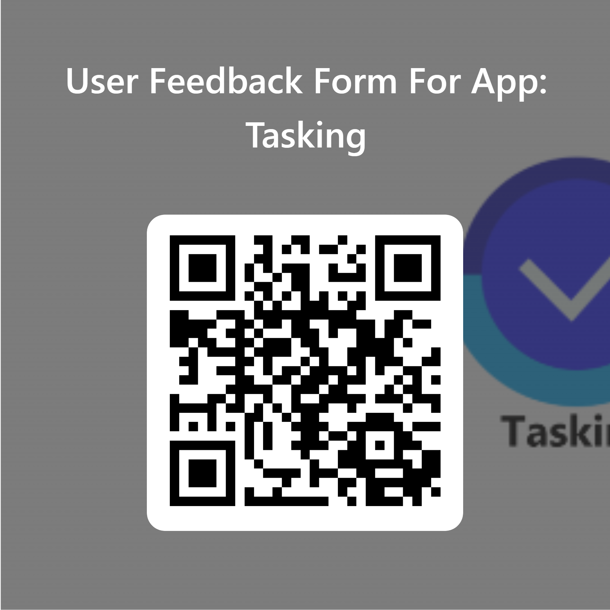
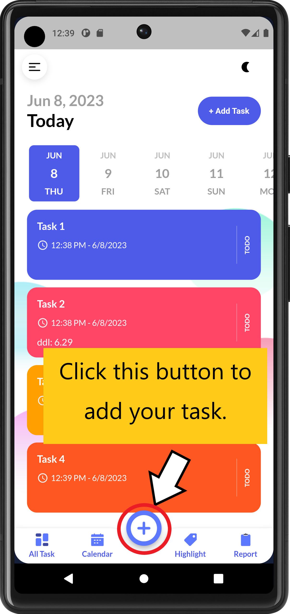
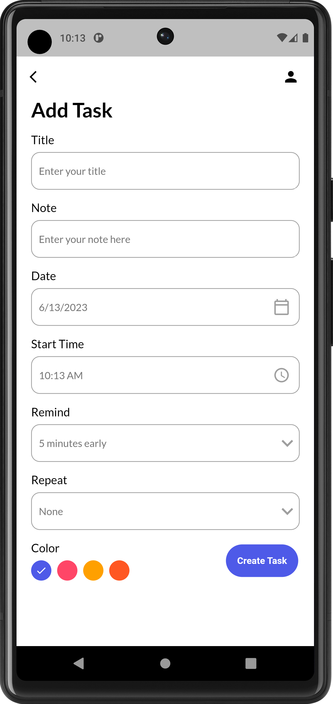
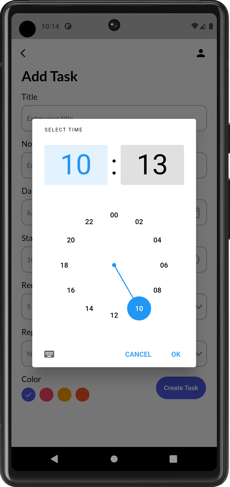
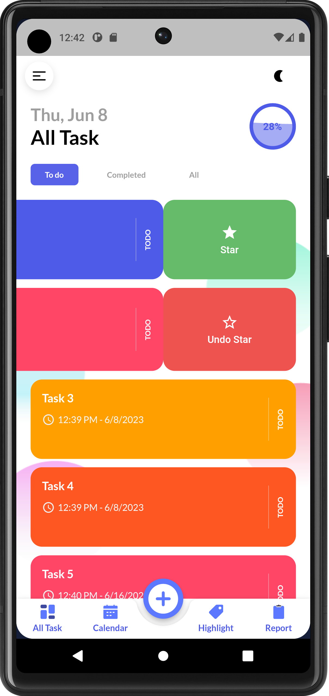
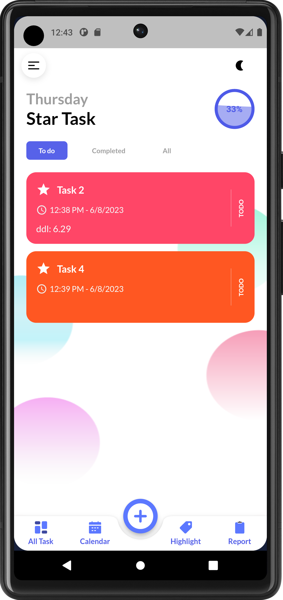
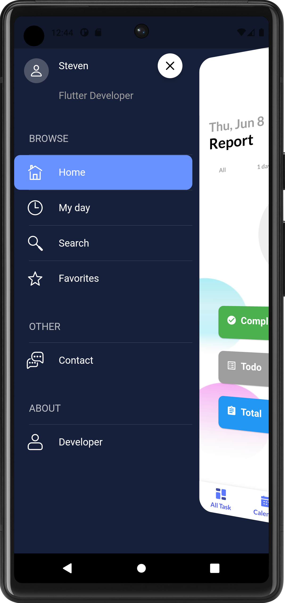

# !!! User feedback questionnaire 用户反馈调查问卷 !!!
Please fill out our questionnaire to make our software better  
请填写我们的调查问卷，让我们以后能更好的优化我们的软件。  

[Tasking User feedback questionnaire](https://forms.office.com/r/L8TqrCBV3d)  



# todo_app_new_edition

A new Flutter project.  

[The advantages of Flutter](https://www.zhihu.com/question/485739670/answer/2950106277)  

## Getting Started

### Description and main functions  
`Tasking: An app for personal task management`

* Easily create tasks, add remarks, and set reminders for recurring tasks.
* Effortlessly view, update, and edit tasks while seamlessly searching through your personalized task list.
* Our vibrant and intuitive UI enhances your task display, making it visually appealing and engaging.
* Experience convenient features like time scheduling, task completion analysis, and the option to switch between Dark and Light theme modes.
* Tasking is built with Flutter + GetX + SQFLite, ensuring a seamless and localized task management experience.
Take full control of your tasks and stay organized with Tasking!

[The planning design of app(proposal)](https://github.com/cn666278/task-todo-new-edition/blob/main/FYP_Final.edited.docx)  

[Main functions design](https://github.com/cn666278/task-todo-new-edition/blob/main/Flutter%20Project%20Note.docx)  

### Run the code
1. Turn off all anti-virus software, personal hot spots
2. Open the project file using Android Studio
3. Run Flutter Doctor to ensure the required runtime configuration
4. Link to your devices(virtual machine or physical machine)
5. Running the project   

### Prototype (GUI design) 
！原型设计请点击下方Figma按钮！  

[](https://www.figma.com/proto/uJzJKBsqYq6PJWWApKvH8D/Task-todo-app?type=design&node-id=729-5182&scaling=scale-down&page-id=0%3A1&starting-point-node-id=729%3A5182)

### Database
`Sqflite` is a lightweight relational database, similar to `SQLite` in iOS and Android  

[SQFLite](https://www.jianshu.com/p/e1a0fb3d202a)

`MySQL+XAMPP`
1. start the MySQL service  
```
cmd -> net start mysql 
```
2. open XAMPP start Apache and MySQL

3. click the admin in XAMPP

4. Enter the http://localhost/phpmyadmin/ page  
5. make php file in C:\xampp\htdocs\dashboard  
  
  
Dart API Package:  
1. [mysql1](https://pub.flutter-io.cn/packages/mysql1)  
2. [mysql_utils](https://pub.flutter-io.cn/packages/mysql_utils)  
  
[Edit your password in MySQL database](https://blog.csdn.net/qq_52487066/article/details/127009665)  

[Flutter Error: Cannot run with sound null safety](https://zhuanlan.zhihu.com/p/405838959)  

[ERROR 1396 (HY000): Operation ALTER USER failed for ‘root‘@‘localhost‘](https://blog.csdn.net/q258523454/article/details/84555847)  


## Others
This project is a starting point for a Flutter application.

Here are a few resources to get you started if this is your first Flutter project:

- [Lab: Write your first Flutter app](https://docs.flutter.dev/get-started/codelab)
- [Cookbook: Useful Flutter samples](https://docs.flutter.dev/cookbook)
- [XMUX Technology reference](https://docs.xmux.xdea.io/developer/architecture/)  
- [XMUX](https://github.com/XMUMY/XMUX)  
- [Rive](https://www.rive.app/)  

For help getting started with Flutter development, view the
[online documentation](https://docs.flutter.dev/), which offers tutorials,
samples, guidance on mobile development, and a full API reference.

## User Hanbook
### demo vedio


### 0. Add Task
You can create your task by clicking the add icon in the middle of the bottom navigation bar.  

On the create page, you can fill
* title of the task (you need to fill in at least the title of the task to create the task, otherwise it will warning: information incomplete),
* Note
* Task Date
* Task start time
* Remind time
* Set whether the task is repeated
* Select the theme color of the task card

    

### 1. All Tasks page
This page is used to display all the tasks created by the current user, and you can freely view different types of tasks according to the three categories(Todo, Completed, All).  

Progress logic(on the upper right corner):
```
progress(%) = completed tasks / all tasks
```

  

### 2. Calendar page
This page is used to display all tasks by date that the user has selected for the current date.  

 

### 3. Highlights page
This page is used to display all your star tasks, and you can freely switch task types according to 3 different categories(Todo, Completed, All).

Progress logic(on the upper right corner):
```
progress(%) = completed star tasks / all star tasks
```

  

### 4. Report page
* This page is used to generate a completion report of the current task, users can evaluate the completion of the current task according to the displayed data, and better arrange their tasks.
* And provides four categories (all, 1 day, 7 days, this month) to facilitate users to view analysis reports according to different time lengths.
* A toggle-style button is provided in the upper right corner, which users can click to change the progress indicator display.

Report logic:
```
efficiency(%) = completed tasks / all tasks
```

    

Click the button on the upper right corner to change the style of displaying.  

  

### 5. Task Details

You can see all the task details by clicking the `Details` button in the corresponding task (the bottom bar of the pop-up below), and you can freely modify the content of the task, and finally update the current task content through the `Update Task` button.

 

### 6. Task Completed

You can edit the state of the task by clicking the `Task Completed` or `Undo Completed` button in the corresponding task (the bottom bar pops up below), and the status of the task(`TODO` or `COMPLETED`) will be displayed on the far right of the task card when the modification is completed.  

  

### 7. Star Task

You can set the priority of our task by right sliding on our task card (by `Star` or `Undo Star`). The task set as 'Star Task' will have a star added to the top left corner of the task card and displayed on the Highlights page.

  

### 8. Sile bar menu  
 

### 9. Search tasks  
You can search for the task by entering the title of that task.

     

### 10. Theme Mode Switch    
Click the Sun/Moon icon on the upper right corner to change the Theme Mode(Light/Dark).

     

## README.md References
1. [Shopify-flutter-demo/README.md design](https://github.com/mehulmk/Shopify-flutter-demo/tree/main)

## License
This project is licensed under the GPLv3 License - see the LICENSE.md file for details.
